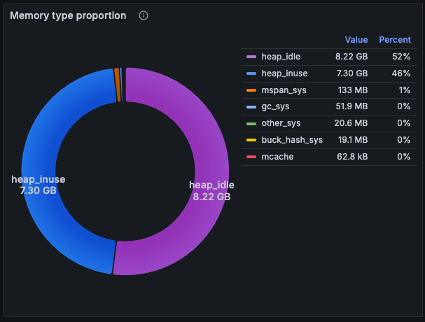
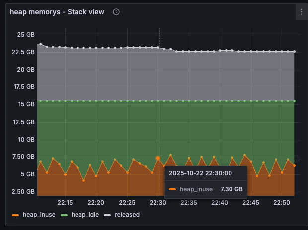
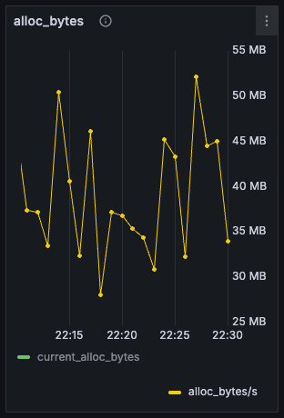

<h1>VictoriaLogs Operational Data Insights</h1>

VictoriaLogs is a high-performance log storage component.

This article shares a set of operational metrics from a single-instance VictoriaLogs deployment in production.

In this article, you'll learn:

* How outstanding VictoriaLogs' performance truly is
* Internal operational details of the log storage engine
* How to optimize configuration based on business data

For the list of VictoriaLogs metrics, see: https://docs.victoriametrics.com/victorialogs/metrics/

# Background

In the production environment, a single-instance container of VictoriaLogs was deployed to receive all business-generated logs.

The metrics data corresponding to the time point of the highest CPU usage throughout the day was recorded.

Since no queries were executed at this specific time point, it primarily reflects the performance of log writing.

# Configuration

| Category       | Configuration Item    | Value    | Description                                                         |
| ---------- | --------- | ------- | ------------------------------------------ ------------------ |
| Server Resource      | CPU cores      | 48      | The metric vm_concurrent_insert_capacity value is 96, reflecting the upper limit of write concurrency |
|                        | Memory      | 64 GB      |                                                              |
|            | Disk      | 16TB    |                                                              |
| Process Configuration   | Storage Period  | 7 days    | The value of metric vl_partitions is 8. Number of partitions is 8, as one partition folder is created daily. With a 7-day storage period, a maximum of 8 partitions can exist. |
|            | Version      | v1.28.0 |                                                              |

# Operational Metrics

## CPU
| Data Item   | Value    | Description                                                         |
| -------- | ------- | --------------------------------------------------- --------- |
| CPU Usage | 25.1 cores | 52.3% of total CPU cores The metric is process_cpu_seconds_total. The container_cpu_usage_seconds_total metric reports 25.6 cores; use  container's internal measurement here. |
| Threads | 139 | Excessive threads due to use cgo when using zstd library. |
| Goroutines | 101 | Goroutine count lower than threads. Indicates very restrained goroutine usage. Well done! |

## Memory
| Data Item   | Value    | Description                                                         |
| -------- | ------- | ------------------------------------------------------------ |
| container_memory_usage_bytes | 61476073472 bytes 57.25 GB | Total memory used by the container. 89.45% of allocated container memory |
| container_memory_working_set_bytes | 38457155584 bytes 35.8 GB | Active memory |
| container_memory_cache | 52578189312 bytes 48.97 GB | Content used for file cache, representing 76.52% of allocated memory container_memory_mapped_file of 42.42 GB is included within memory_cache |
| container_memory_rss | 8484524032 bytes 7.9 GB | Actual physical memory used, accounting for 12.34% of allocated container memory |

The actual physical memory used is further broken down as follows:

The composition of the Golang runtime heap is as follows:

VictoriaLogs exhibits excellent memory allocation optimization, as illustrated below:

With an average allocation of only about 40 MB per second, this indicates extensive use of object pools like sync.Pool.

## Storage

Storage bases Alibaba Cloud's VPC.

| Data Item      | Value            | Description                                                         |
| -------- | ------- | ----------------------------------------------------------- - |
| Used Disk Space | 12372666871808 bytes 11.25 T | 70.3% of total space |
| Handle Count | 5230 | Cannot distinguish file fds and sockets at this time |
| Total Dropped Rows | 0 | Indicates no log loss has ever occurred |
| Disk Read Throughput (Logical) | 123999970 bytes/s 118.26 MB/S | From metric vm_filestream_real_read_bytes_total **Consistent disk read/write activity indicates the background merge process is running smoothly. ** |
| Disk Write Throughput (Logical) | 153990664 bytes/s 146.86 MB/S | From metric vm_filestream_real_written_bytes_total |
| Disk Reads Per Second (Logical) | 1893 calls/s | vm_filestream_real_read_calls_total |
| Disk Writes Per Second (Logical) | 1176 calls/s | vm_filestream_real_write_calls_total |
| Disk block device read volume (physical) | 87,431,646 bytes/s 83.38 MB/S | container_fs_reads_bytes_total Metrics sourced from **cAdvisor** or **containerd / kubelet** statistics, typically corresponding to the blkio layer of cgroups. It reflects **actual I/O statistics on underlying block devices for all processes within the container**. **Only I/O that actually hits the block device** is counted; reads/writes within the kernel page cache are not immediately included in these counts. |
| Disk block device writes (physical) | 131454020 bytes/s 125.36 MB/S | container_fs_writes_bytes_total Implementation principle as above |
| Disk block device reads (real IOPS) | 1297 ops/s | container_fs_reads_total Based on frequency, the storage device must be an SSD; mechanical disks(HDD) cannot sustain such high IOPS |
| Disk block device write operations (real IOPS) | 1880 ops/s | container_fs_writes_total The operating system periodically writes dirty page cache to disk, so container_fs_writes_total is not directly correlated with vm_filestream_real_write_calls_total. |

## Network

| Data Item   | Value    | Description                                                         |
| -------- | ------- | ----------------------------------------------- ------------- |
| Network Inbound | 520 MB/S | From metric container_network_receive_bytes_total |
| Network Outbound | 124 KB/S | From metric container_network_transmit_bytes_total |
| Log Data Ingest Rate | 465881848 bytes/s 444.3 MB/S | From metric vl_bytes_ingested_total |

## Ingestion Rate

| Data Item      | Value            | Description                                                         |
| -------- | ------- | --------------------------------------------- --------------- |
| Logs received rate | 491,641 rows/s | From metric vl_rows_ingested_total |
| insert_processors_count | 11 | Number of concurrent coroutines writing logs |
| vl_too_long_lines_skipped_total | 0 | No data discarded during writing |

## Indexed Data Volume

In VictoriaLogs, fields designated as `StreamFields` are written to the index.

| Data Item      | Value            | Description                                                         |
| -------- | ------- | --------------------------- --------------------------------- |
| Log ingestion rate | 491,641 entries/s | From metric vl_rows_ingested_total |
| Indexed rows | 83,180 | From metric vl_indexdb_rows |
| Indexed disk capacity | 2601009 bytes 2.48 mb | vl_data_size_bytes{type=“indexdb”} |

## Log Data Volume

All `tags` and `_msg` fields in the logs, along with their associated `bloom filter bitmaps`, are written to the data section of VictoriaLogs.

| Data Item      | Value            | Description                                                         |
| -------- | ------- | ----------------------------------------------------------- - |
| Big partition log entries | 204037001713 | vl_storage_rows{type=“storage/big”} |
| Small partition log entries | 699306811 | vl_storage_rows{type=“storage/small”} |
| Inmemory log entries | 13792407 | vl_storage_rows{type=“storage/inmemory”} |
| Log disk used | 12163334662045 bytes 11.06 TB | vl_data_size_bytes{type=“storage”} |

## Merge-related Metrics

| Data Item      | Value                | Description                                                         |
| -------- | ------- | ----------------------------------------------------------- - |
| Merge concurrency: storage/inmemory | 13 | Equivalent to writing in-memory cached blocks to disk. Metric: vm_concurrent_insert_current |
| Merge concurrency: storage/big | 3 |   |
| Merge concurrency: storage/small | 2 |   |
| Merge count: storage/inmemory | 921 times/min Aka: 15.35 ops/s | Metric: vl_merges_total |
| Merge count: storage/big | 1 time/min |   |
| Merge Count: storage/small | 5 per minute |   |
| Merged Log Rows: storage/inmemory | 1,350,000 per second | Metric: vl_rows_merged_total |
| Merged Log Rows: storage/big | 0 per second | Note: Large partitions do not always have data requiring merging |
| Merge log rows: storage/small | 452,000 rows/s |   |

The above data reveals:

* Inmemory blocks handles the highest merge concurrency and log processing volume. Logs are first written to memory, undergo various merge operations based on log characteristics, and are then periodically written to disk. This is an essential approach for performance optimization.
* Small partitions require maintaining a certain merge throughput. After all, InMemory block data is written to disk quickly to prevent data loss during power outages. Once written, this data with lower compression ratios needs to be merged by merge coroutines into the more highly compressed big partitions.

* My view: While ensuring normal writes and queries, the merge process for big partitions could be more aggressive. Utilize all remaining CPU and memory to achieve higher compression ratios for logs.

# Conclusions

## CPU

With 25.1 cores utilized and incoming log data at 444.3 MB/S, we can roughly estimate:

* **Single-core maximum log write performance: 17.7 MB/S**

Given the log entry rate of 491,641 entries/s, the average log entry size is: 465,881,848 / 491,641 = 947.6 bytes/row.

Rough calculations:

* **With logs approaching 1 KB each, the single-core maximum log write performance is: 19,587 rows/s**

VictoriaLogs excels in concurrent design, with the number of threads and coroutines being relatively low compared to the allocated cores.

Statistics from `increase(go_mutex_wait_seconds_total{pod=“xxx”}[1m])` reveal a total of 1.64 seconds spent waiting for locks per minute. Averaged across cores, this equates to 1.64 / 48 = 34 milliseconds, meaning **each core spends an average of 34 milliseconds per minute waiting for locks**.

## Memory

VictoriaLogs excels in memory management. By extensively utilizing object pools internally, it effectively reduces:

* Memory allocation overhead
* Garbage collection overhead
* Memory jitter

Regarding overall memory usage, while it appears to utilize 57.25 GB out of 64 GB of physical memory, the process actually consumes only 7.9 GB (12.34%) of physical memory. The remaining memory is occupied by file caches (which can be evicted at any time to free up memory for the process).

Conclusion: **Without considering query performance impact, VictoriaLogs' CPU-to-memory ratio can be adjusted to 2:1, meaning 1 GB of memory per two CPUs.**

Based on the 13,792,407 log entries in inmemory, the subsequent calculation shows the average length of a compressed log entry is 59.4 bytes. Thus, the cached logs occupy 781 MB of space. At this scale, caching logs appears to impose minimal memory pressure.

## Networking

It is evident that there is virtually no network outbound traffic when no queries are being processed.

One area worth optimizing here is: **Configuring gzip compression on the `Vector` process responsible for log transmission may cause a slight increase in VictoriaLogs CPU usage, but the overall resource utilization rate could be lower.**

VictoriaLogs' primary resource bottleneck is CPU; in comparison, network traffic consumption is relatively low.

## Storage Engine: Index

Although 7 days of log data occupy 11.25 TB of disk space, the index on disk occupies a mere 2.48 MB—an astonishingly small amount. (I specifically tracked the source code; logically, metrics indeed report the actual index size.)

Additionally, the number of index entries is very low, totaling only 83,180.

This minimal indexing is achieved by extremely restrained configuration of `StreamFields`—few fields are set, and they change infrequently. Indexes are created only upon the first discovery of a new `StreamField`, meaning index growth is directly proportional to the rate of `StreamFields` changes.

Analysis revealed:

* `increase(vl_streams_created_total{}[5m])` shows only 1-2 new streams created every 5 minutes, indicating minimal index growth and consequently a small index size within seven days.

* The low stream increment also increases the log write volume per unit time, effectively eliminating the need to write any data to the index component.

This also reveals an issue with our business configuration:

The `StreamFields` configuration is overly restrictive. While it reduces indexing, queries may suffer from insufficient indexes, forcing searches across a small number of block types with massive overall data volumes. **Insufficient stream growth leads to inadequate index creation, requiring careful balancing.**

## Storage Engine: Data

Log data occupies 11.06 TB of disk space. Summing logs from big partitions and small partitions yields an **average log length on disk of 59.4 bytes per entry**.

Compared to the average log length of 947.6 bytes/entry calculated during data ingestion, after VictoriaLogs processing, **the log compression ratio is: 947.6 / 59.4 = 16 times.**

# Summary

* VictoriaLogs' maximum write performance per‑core is 17.7 MB/S
* When the average log length is around 1 KB, the peak write performance per‑core is 19,587 entries/s
* During deployment, allocate resources at a ratio of 1 GB of memory per 2 cores
* VictoriaLogs still demands high disk IOPS, requiring storage devices like SSDs
* Configure `StreamFields` appropriately to avoid excessive index growth while preventing insufficient indexing.
* Adding gzip compression for log data at the `Vector` log collection endpoint is preferable.

To the VictoriaLogs development team, I would like to suggest:

* Pursue more aggressive data compression and extend memory buffering duration: to ensure good performance even on HDD mechanical drives,  ultimately further reducing log storage costs.
* For `StreamFields`, I'd like to add a configuration such as `IndexField`:
  * On the one hand, we can control the block types for the data portion to maintain higher compression ratios.
  * On the other hand, businesses can index specific tags as needed to improve query performance.
    * Currently, `StreamFields` only creates indexes upon the first occurrence of a tag, meaning subsequent tag values outside the `StreamFields` are not indexed. Adopting the IndexField mechanism could prevent this limitation.

* Metrics for cache is insufficient, and cache turning command-line arguments should be provided.

* While ensuring reliable writes and queries, merge operations for large partitions could be more aggressive. Utilize remaining CPU and memory to achieve higher log compression ratios.

Thanks to the VictoriaLogs team—this component's performance and stability are truly impressive.

(As a side note, I previously proposed a PR adding SIMD optimizations, but rejected by team.  :-(  If you actively adopt SIMD, I believe data ingestion performance could double.)

# Links

I've written a document detailing VictoriaLogs' internal implementation: [InsideVictoriaMetrics : 8_VictoriaLogs Basics.md](https://github.com/ahfuzhang/InsideVictoriaMetrics/blob/main/chapters/8_VictoriaLogs%E5%9F%BA%E7%A1%80%E7%9F%A5%E8%AF%86.md)

