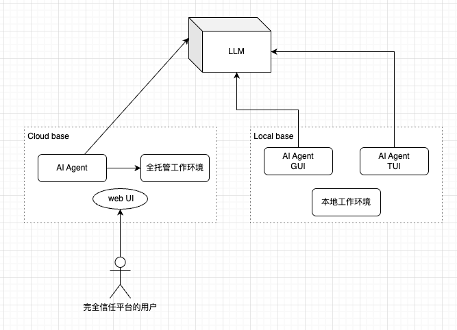
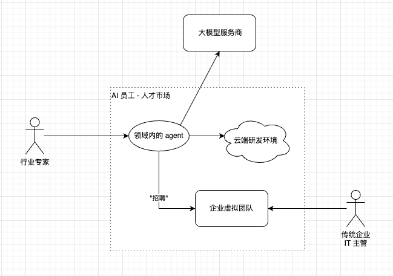

《关于 AI Agent，为什么我的想法可能不靠谱？——重读〈The Bitter Lesson〉》

# 引子

我觉得我发现了一个现实世界的矛盾：

理论上而言，商业的闭源的基于 SaaS 模式的软件系统，理论上会比开源的基于客户端的同功能系统，更加好用，更加智能。典型的例如 Salesforce：

* 一套庞杂的 CRM 系统如果完整地运行在一个简单的客户端程序上，难度太大了。大规模的软件系统基于云端更容易实现。
* 云端的系统可以无缝、快速地升级，比升级客户端方便多了；产品的迭代速度也更快。
* 云端有很强的保密优势，因此行业专家经验、算法等知识成果可以不断积累，并形成壁垒。
* 算力优势、存储优势：可以管理海量数据，且 Web 端在秒级就能得到结果。

既然商业 SaaS 这么好，为什么这件事情没有出现在 AI Agent 上？

> 截至 **2026 年 9 月：**
> OpenAI 官方明确把 Codex 描述为具有 **cloud environments / cloud agents** 的产品，而且 Codex 可以在本地和云端之间工作。[OpenAI](https://openai.com/codex/?utm_source=chatgpt.com) Anthropic 也已经发布了 **Claude Code on the web**，让 Claude Code 在隔离的云端 sandbox 中执行。

即便云端 Agent 已经存在，但它与本地 Agent 的“智能差距”，却远没有我原先想象得那么大？

云端 Agent 更容易获得客户端 Agent 难以获得的大规模计算、长时间执行、并行 Agent、持久环境、集中知识库等能力。理论上，云端 Agent 最终在智能表现上也要明显高于客户端的 Agent。

以 OpenAI 为例，Codex 的 Web 版本，完全可以开发为一个全托管的 SaaS 方式的云端开发环境。如果我愿意把源码托管到 OpenAI 的云端，那么云端的 agent 的智力水平会远高于客户端的 Codex。

毕竟客户端容易被破解，商业公司把具备竞争力的功能做到客户端 agent 是有风险的，这些功能被反向工程突破后，技术壁垒就会被突破；由此，做基于 SaaS 模式的 agent 就不必担心技术卖点被泄露。

就这么一个我这个普通从业者都能想明白的技术架构 + 商业模式，在现在 agent 林立的 AI 圈子里，居然对 “基于 SaaS 的 Agent” 这个概念接触得如此之少。如果我的逻辑成立，我们应该会看到 Claude Code 云端版本或者 Codex 云端版本，且云端版本的能力强于客户端版本。



（理论上：左边的工作模式会比右边更爽）

# 我假想的商业模式

这些日子我在头脑里做“思想实验”：如果我也去跟风 AI 创业这波浪潮，我会做什么？

我 YY 的是：为行业专家提供云端 agent 平台，向客户卖 "AI 员工"。



我的创业想法基于以下假设：

* 仍然存在大量的传统企业，他们的 IT 系统/软件系统仍然陈旧，需要升级；但是以前的软件开发仍然“昂贵”，采购先进的软件系统，或者招聘一定技术水平的开发团队，对于这些传统企业而言都是不划算的。
  * 如果在研发体系完善度、技术水平成熟度、招聘成本等等方面进行考量，能够快速为传统企业搭建起一套贴合自身的研发体系，传统企业仍然是具备很强的付费意愿的。
* 把各种传统的软件开发团队的角色虚拟化为对应的 agent。例如：
  * AI 产品经理：专长为需求分析，能够撰写详尽专业的需求文档
  * AI 架构师
  * AI 后端开发
  * AI 前端开发
  * AI 测试
  * AI SRE 工程师
* 对于特定领域，行业专家会把自己的专业经验，做成垂直行业的 agent
  * 例如教育行业、建筑行业……把这个行业特有的先验知识整合到 agent 中；各种最佳实践也整合在 agent 中。
  * 行业专家在开发垂直领域 agent 时，会融入自己的做事方法和性格，特别是与客户沟通的方法和话术。
  * 垂直领域 Agent 会变成“AI 员工”：能够介绍自己的专长和特点，同时接受平台统一的基础评测，甚至可以有自己的个性。
* “AI 员工”本质上是基于 SaaS 模式的 agent，除了依赖模型提供商和云端研发环境外，更重要的是其中注入了人类领域专家的大量智慧。在垂直领域工作表现越好的“AI 员工”，越会受到客户的追捧。
* 客户会在“虚拟 AI 人才市场” 中选择各种各样的 "AI 员工"，并且根据能力和“聘用月薪”来决定要不要加入虚拟团队中
  * 客户支付给 “AI 员工” 的 “工资”，相当于 SaaS 软件的订阅费用
  * AI 员工的工资，一部分会用于支付大模型服务商的 token 成本。因此，AI 员工不只是要聪明，省 token 也是有价值的。
  * 平台和行业专家，会对“AI 员工”产生的利润进行分成
* 最终：平台，行业专家，客户三者会因为整个技术体系和商业模式而达到共赢。


在我的“创业项目”中，我想通过 “SaaS 模式的 agent”来构建平台。而现实世界中，模型能力最强的大厂却又没有做这个方向的平台。我的想法真的靠谱吗？为什么大厂没有做类似的事情？


# 再读 “苦涩的教训 A bitter lesson”

> 以下引入 AI 解读的 《苦涩的教训》
>
> 本章节的内容由 AI 创作。

 **《The Bitter Lesson》（苦涩的教训）**，是强化学习奠基者 **Richard Sutton** 在 **2019 年**写的一篇很短的文章，严格说更像一篇研究随笔，不是一篇传统学术论文。Sutton 自己的 publication list 里也把它标成 “blog, one and a half pages”。[Incomplete Ideas](https://incompleteideas.net/publications.html?utm_source=chatgpt.com)

它的核心观点可以浓缩成一句话：

> **AI 历史上，最终真正取得巨大进步的，往往不是人类把自己的知识精巧地写进系统，而是那些能够随着计算量增加而不断变强的通用方法。**

这里所谓的通用方法，Sutton 特别强调两类：

**搜索（search） + 学习（learning）**

也就是说，与其让专家告诉 AI：

```
这个局面应该这样下棋
这个图像里边缘很重要
语言应该按照这些语法规则分析
这个特征应该人工提取
```

不如让机器：

```
大量计算
    ↓
大量搜索 / 大量数据
    ↓
自己学习表示和策略
    ↓
随着算力增加继续提升
```

Sutton 回顾 AI 历史时发现了一种反复出现的模式。

早期研究者通常会觉得：

> “我们已经知道很多关于这个问题的知识，把这些知识编码进去，AI 一定会更强。”

短期来看，这通常确实有效。

但几年或十几年以后，**依赖大量计算的通用算法最终会超过这些人工设计系统。**

例如象棋：

早期象棋程序大量加入棋手知识：

```
中心控制
兵型
王的安全
棋子价值
残局规则
...
```

后来真正占据优势的路线越来越依赖：

```
搜索更多局面
+
更强的评估函数
+
更多计算
```

围棋的例子更加明显。

过去人们认为围棋必须加入大量人类围棋知识，因为搜索空间太大。但 AlphaGo / AlphaZero 证明：

```
神经网络学习
+
Monte Carlo Tree Search
+
海量计算
```

最终远远超过了传统人工规则系统。

Sutton 认为类似事情还发生在：

```
Chess
Go
Computer Vision
Speech Recognition
```

等领域。[Incomplete Ideas](https://incompleteideas.net/publications.html?utm_source=chatgpt.com)

------

### 为什么叫 “Bitter Lesson”？

“苦涩”就在这里。

对 AI 研究人员来说，我们天然喜欢相信：

> 人类理解的问题结构非常重要。

于是会投入大量时间研究：

```
人类如何识别物体？
人类如何理解语言？
专家如何下棋？
人类如何推理？
```

然后试图：

```
把这些知识编码进 AI
```

但 Sutton 的结论却是：

> **几十年的 AI 历史不断证明，这种路线长期来看经常输给可以利用更多计算的通用算法。**

对于研究者来说，这是一个很难接受的结论，因为这意味着很多“聪明的人工设计”最终可能只是临时优势。

所以才叫：

**The Bitter Lesson——苦涩的教训。**

------

### 他真正想强调的是“可扩展性”

我认为理解这篇文章最重要的一个关键词是：

> **scaling**

假设有两个算法：

```
算法 A：
加入大量专家规则
CPU ×10 → 性能提高 5%

算法 B：
规则很简单
但可以搜索 / 学习
CPU ×10 → 性能提高 50%
CPU ×100 → 性能提高 500%
CPU ×10000 → 性能继续提高
```

长期来看，B 往往会赢。

所以好的 AI 方法应该具备一个性质：

```
更多 compute
更多 data
更多 experience
      ↓
能够持续转化成
      ↓
更强 intelligence
```

Sutton 认为历史告诉我们：

**能够吸收计算资源的方法最终胜出。**

------

这篇文章其实对今天的 **LLM** 非常有预见性。

你可以把过去几十年的 NLP 简化为：

```
1990s / 2000s

人工语法
词性规则
句法规则
语言学特征
专家系统
        ↓
     NLP 系统
```

后来：

```
大量文本
   +
神经网络
   +
梯度下降
   +
GPU
   ↓
Transformer
   ↓
GPT
```

甚至模型内部到底如何表示：

```
语法
概念
推理
世界知识
```

很多都不是程序员直接写进去的，而是**训练出来的**。

这几乎就是 Bitter Lesson 的一个现实案例。

不过它并不是说：

> **领域知识完全没有用。**

更准确的理解是：

> 不要让大量人工知识成为系统性能增长的主要来源；优先设计那些可以利用越来越多计算、数据和经验的算法。

所以如果用一句工程师式的话总结 Sutton：

```
不要过度优化 human knowledge。
优化 scaling law。
```

或者更直白一点：

> **不要试图亲手教机器如何思考；设计一种机制，让机器能够用计算自己学会如何思考。**

这也是为什么《The Bitter Lesson》虽然只有大约一页半，却成为后来讨论 **Scaling、LLM、AGI、RL** 时经常被引用的一篇文章。[Incomplete Ideas](https://incompleteideas.net/publications.html?utm_source=chatgpt.com)

# 我的理解

我认为我理解了：

* 为什么 OpenAI、Anthropic 已经在做云端 Agent，但云端版本相对于本地 Agent，并没有形成我原先想象中的巨大能力差距和技术壁垒？
* 为什么 “基于人类行业专家的经验来做基于 SaaS 的垂直行业的 AI Agent” 这件事情不靠谱？

根据“苦涩的教训”，可以推导出：

* 在 AI Agent 上取得的能力提升，相比模型智能的提升，不值一提！
  * 我们想象中：我们把 agent 的工作流编排得很好，就算用智能普通的模型，也能取得很好的效果
  * 实际可能是：下一代模型智能的提升，直接抹平了过去几年在 agent 上付出的努力
* 把人类专家的经验沉淀到 AI Agent 中，其取得的进步优势，相比增加算力+通过搜索和学习获得的进步而言，不值一提！
  * 回想一下 AlphaZero 吧，人类几千年总结的各种围棋对弈的范式，在搜索和学习这样的方法面前不值一提。跳出人类思维的框框，我们反而可能取得更大的进步。

因此：

* 为什么 OpenAI 和 Anthropic 不去做明显可以构成壁垒的基于 SaaS 的 AI Agent，而是敢于大大方方的开源出来？因为去强化 Agent 这件事情在本质上就与“苦涩的教训”矛盾了。
* 业界现在流行一种说法：模型是“大脑”，而 AI Agent 是“身体”，强健的身体同样重要！于是：提示词工程 -> 上下文工程 -> Harness 工程 -> Loop Engineering -> 图工程 …… 各种各样的新词汇应接不暇，本质上都是想要在 Agent 上去强化。而所有在 Agent 上的努力，终会被模型智能的提升抹平。
  
* 最后，究竟什么才算是模型这个“大脑”对应的“身体”？搬运电子的是大脑，搬运原子的才是身体，而 Agent 本质上还是搬运电子，它所做的工作相比模型智能，实在是，不值一提！

# 我的暴论

* 开发 AI Agent 这件事情：
  * 应该总是去选择投入小效果大的、杠杆率最高的工作来做；Agent 开发上的所有投入，最终都变成沉没成本。因此，做 Agent 开发这条赛道，主打短平快；想要憋大招只会死得更早。
  * 别指望通过长期投入 AI Agent 的研发来建立技术壁垒，或者是别指望通过 AI Agent 这样的产品来长期赢得市场 —— 技术上的优势会被新一代的模型能力抹平，AI Agent 更像是薄薄的胶水层，注定是昙花一现的技术。
  * 普通的开发者，别去跟风卷 Agent 的开发技术。Agent 上的功能就像是 10 年前被要求做一个 HTML 页面来搞个运营活动，一周后活动下架，这个 HTML 再也不用了——所有这些功能都像是快消品。核心的问题还是梳理清楚做事的逻辑，或通过 agent 的能力来组织逻辑，或通过严谨的提示词来组织逻辑，而不是通过开发强悍的 agent 来期待更好的产出。
* 展开想象：假设模型输出的内容不是文本，而是 X64 或者 Arm64 的指令流，那我们还需要 Agent 吗？
  * 例如下图：模型的输出已经不考虑是否人类可读了。
  * 未来：模型甚至可以直接输出指令流来指挥机器进行计算。


* 有了 RSI (recursive self-improvement)，人类专家的经验反而对于文明的发展是一种阻碍。
  * 就好像还有好多好多人看中医、喝中药一样 —— 祖传的就好吗？历来如此就对吗？
  * human knowledge 不应该成为 AI scaling 的主要来源
  
* 近期腾讯 WorkBuddy 因亮眼表现而受到业界关注。根据“苦涩的教训”，这明显是错误的战略。
  * 如果 WorkBuddy 的长期壁垒主要建立在人为编排 workflow / harness，而这些能力又会被基础模型持续吸收，那么这种壁垒可能会快速贬值。

  * 如果想要在 Agent 这条赛道上获得在 AI 领域的竞争力，这注定是失败的。


