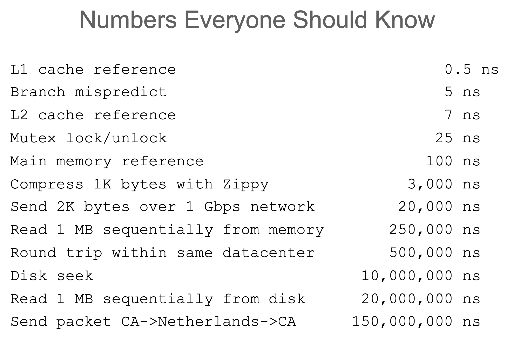
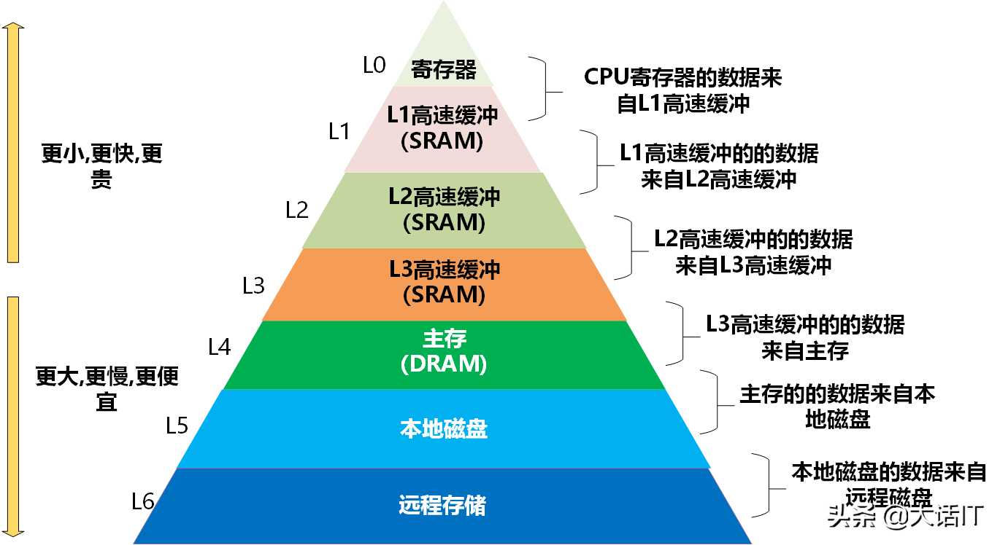

# 海量后台开发——从入门到放弃

**<font size=1 color=gray>作者:张富春(ahfuzhang)，转载时请注明作者和引用链接，谢谢！</font>**
* <font size=1 color=gray>[cnblogs博客](https://www.cnblogs.com/ahfuzhang/)</font>
* <font size=1 color=gray>[zhihu](https://www.zhihu.com/people/ahfuzhang/posts)</font>
* <font size=1 color=gray>[Github](https://github.com/ahfuzhang)</font>
* <font size=1 color=gray>公众号:一本正经的瞎扯</font>


----


```
本文主要是列出一个成长路径，及其后台领域的关键词，通过【走马观花】【浅尝辄止】的方式让新同学领略后台开发的魅(ku)力(bi)。

 【海量】是本次分享要强调的另一个关键词。当一个后台系统的负载不大的时候，往往是“怎么做都没错”；然而，当系统需要处理海量的请求时，一切又完全不一样：
 ​	1.满足海量的要求很难，错误的选型或者架构设计可能让系统的处理能力始终卡死在某个“天花板”上，再也上不去；
 ​  2.应对海量的策略要对，否则系统可能轻易被突增的流量压垮；或者是在变更期间变得非常脆弱。（可能多打一行日志可能都会引起处理能力的剧烈抖动）

 本课程分享的思路是：
     1.了解海量后台的技术是怎么一步一步演化到今天的样子；
     2.尽可能建立一个知识图谱，广泛的了解海量后台所需的知识点；
     3.从场景出发，对海量后台的复杂知识体系“各个击破”，先学会解决一小个领域的问题，再能够拓展到复杂的业务环境中去；
     4.附带介绍一些后台领域稍微前沿的知识。

 本课程第一版最早分享于腾讯课堂：https://ke.qq.com/course/213315
```


2024-03补充：目前已经有一本书很好的讲述了我想要表达的内容，建议做后台开发的同学直接阅读此书：

* [数据密集型应用系统设计](https://book.douban.com/subject/30329536/)


----


【目录】

[toc]

# 1.如何写一个单机服务
```
如何写出一个高性能的单机网络服务程序？这一章介绍网络编程和服务框架的一些基础知识。
```
## 1.1 基本概念


### 1.1.1 同步 vs. 异步

see: 《[计算机领域中的同步（Synchronous）和异步（Asynchronous）](https://blog.csdn.net/shiyong1949/article/details/80854656)》

> 同步就是整个处理过程顺序执行，当各个过程都执行完毕，并返回结果。是一种线性执行的方式，执行的流程不能跨越。一般用于流程性比较强的程序，比如用户登录，需要对用户验证完成后才能登录系统。
>
> 异步则是只是发送了调用的指令，调用者无需等待被调用的方法完全执行完毕；而是继续执行下面的流程。是一种并行处理的方式，不必等待一个程序执行完，可以执行其它的任务，比如页面数据加载过程，不需要等所有数据获取后再显示页面。
>
> 他们的区别就在于一个需要等待，一个不需要等待，在部分情况下，我们的项目开发中都会优先选择不需要等待的异步交互方式，比如日志记录就可以使用异步方式进行保存。
>
> (引用的样式代表直接摘抄了网络文章的内容，非本人原创，下同)

* 可理解为做事的方式
  - 同步：顺序的从头到尾的做事
  - 异步：根据事件触发的被动响应的做事

### 1.1.2 阻塞 vs. 非阻塞

see: 《[怎样理解阻塞非阻塞与同步异步的区别？](https://www.zhihu.com/question/19732473)》

> 阻塞和非阻塞关注的是**程序在等待调用结果（消息，返回值）时的状态.**
> 
> 阻塞调用是指调用结果返回之前，当前线程会被挂起。调用线程只有在得到结果之后才会返回。
> 非阻塞调用指在不能立刻得到结果之前，该调用不会阻塞当前线程。

* 可理解为操作系统API的特点：
  - 阻塞：调用后，要等到操作系统执行完成后才会返回
  - 非阻塞：向操作系统发一个通知，然后立即返回

### 1.1.3 并行(Parallel) vs. 并发(concurrent)

* 并行：执行上的同时
  * 多核编程领域的知识
  * 《[多核编程基础](https://ke.qq.com/course/192009)》
* 并发：事件上的同时
  * 对事件的处理可以是串行的
  * 一定不能阻塞主循环

### 1.1.4 四种组合


|   | 阻塞 | 非阻塞|
| ---- | ---- | ---- |
| 同步 | NTP服务  | 一次性发N个请求给服务器端，然后等待结果  |
| 异步 | X(没有这种组合) | **当前的绝大多数的网络框架的做法**  |

### 1.4.5 NTP(Network Time Protocol)服务例子
```c
//伪代码
int main(){
    SOCKET s = socket(AF_INET, SOCK_DGRAM, 0);
    bind(s, addr, sizeof(*addr));
    for (;;) {
      int n = recvfrom(s, buf, buf_size, 0, &out_addr, &addr_len);
      gettimeofday(&tv, NULL);
      sendto(s, buf, buf_len, 0, &dest_addr, dest_len);
    }
}
/*
 UDP SERVER
 1核 2.6GHz, 16G内存
 千兆网卡
 性能：229000/s
*/
```


### 1.4.6 纯异步非阻塞服务的典型结构
* 主循环
```c
//伪代码
int main(){
    SOCKET s = socket(AF_INET, SOCK_STREAM, 0);  //创建套接字
    setNonBlocking(s);  //设置为非阻塞
    int poll_fd = epoll_create(100);  //创建epoll对象
    epoll_ctl(poll_fd, EPOLL_CTL_ADD, s, event);  //添加到epoll
    bind(s, addr, sizeof(*addr));
    listen(s, 10);
    for (;;) {
        epoll_wait(poll_fd, events, &maxevents, timeout);  //等待事件
        for (int i=0; i<maxevents; i++){
            switch (events[i]){
            case ClientAccept:  //新用户进入
            	doNewClient();break;
            case ClientDataArrive:  //数据到达
            	doRecvData();break;
            case ClientSendBufferValid:  //发送缓冲区可用，写事件
            	doSendDataAgain();break;
            case OnTimer:  //定时器
            	doTimer(); break;
            case OnError:  //连接断开等错误
            	doErrorHandle();break;
            default OnIdel;  //空闲
            	doOtherThings();break;
            }
        }
    }
}
```
* session管理：
```c
struct Session{
	//保存每个连接的状态
}

std::unordered_map<int, Session*> users;  //所有连接的会话状态  fd -> state

```
* 总结：
  * 非阻塞API
  * 事件循环
  * 状态机
  * 优点
      * 没有IO等待
      * 充分利用CPU
      * 数据拷贝较少(相对多进程同步框架而言)
  * 缺点
      * 不小心阻塞了主循环就会带来大量超时（调用了会阻塞的API，或者大循环耗时很长）
      * 事情往往一次做不完，要随时记得记录处理状态
      * 难写

* `扩展阅读：`
  - [libevent](https://github.com/libevent/libevent): 基于C实现对epoll的封装
  - [netpoll](https://github.com/cloudwego/netpoll): 基于go实现的对epoll的封装

### 1.4.7  多线程同步框架的典型结构


* IO线程部分是纯异步非阻塞的模式
* 通过队列来分发任务
* 业务开发简单，使用同步方式
* 性能有限，特别是工作线程中存在网络IO的时候

### 1.4.8 扩展知识
* io_uring( linux I/O use RingBuffer) 

> `io_uring` 是 2019 年 **Linux 5.1** 内核首次引入的高性能 **异步 I/O 框架**，能显著加速 I/O 密集型应用的性能。
>
> ——《[[译] Linux 异步 I/O 框架 io_uring：基本原理、程序示例与性能压测](https://arthurchiao.art/blog/intro-to-io-uring-zh/)》

* 经测试：性能比epoll高出 5% ~ 40%


## 1.2 协程
```
通过下面的介绍可以了解一个协程库是怎么做出来的。
```
### 1.2.1 基本概念
* 操作系统做进程切换的秘密：寄存器，堆栈指针，指令指针
* 几个关键函数:
```c
#include <ucontext.h>
void makecontext(ucontext_t *ucp, void (*func)(), int argc, ...);
int swapcontext(ucontext_t *oucp, ucontext_t *ucp);
int getcontext(ucontext_t *ucp);
int setcontext(const ucontext_t *ucp);
```
### 1.2.2 一个简单的协程库
* 云风：《[C 的 coroutine 库](https://blog.codingnow.com/2012/07/c_coroutine.html)》
* 协程库的核心结构：
```c
//coroutine.h
#ifndef C_COROUTINE_H
#define C_COROUTINE_H

#define COROUTINE_DEAD 0  /*协程的调度状态*/
#define COROUTINE_READY 1
#define COROUTINE_RUNNING 2
#define COROUTINE_SUSPEND 3

struct schedule;

typedef void (*coroutine_func)(struct schedule *, void *ud);

/// 初始化协程库
struct schedule * coroutine_open(void);

/// 释放资源
void coroutine_close(struct schedule *);

/// 创建协程
int coroutine_new(struct schedule *, coroutine_func, void *ud);

/// 恢复某个协程的执行
void coroutine_resume(struct schedule *, int id);

/// 当前协程退出
void coroutine_yield(struct schedule *);

/// 查询协程状态
int coroutine_status(struct schedule *, int id);
int coroutine_running(struct schedule *);

#endif
```

* 协程库的使用: 
```c
//main.c
#include "coroutine.h"
#include <stdio.h>

struct args {
	int n;
};

static void
foo(struct schedule * S, void *ud) {  //协程函数
	struct args * arg = ud;
	int start = arg->n;
	int i;
	for (i=0;i<5;i++) {
		printf("coroutine %d : %d\n",coroutine_running(S) , start + i);
		coroutine_yield(S);  //协程函数主动让出
	}
}

static void
test(struct schedule *S) {
	struct args arg1 = { 0 };
	struct args arg2 = { 100 };

	int co1 = coroutine_new(S, foo, &arg1);
	int co2 = coroutine_new(S, foo, &arg2);
	printf("main start\n");
	//协程的主循环
	while (coroutine_status(S,co1) && coroutine_status(S,co2)) {
		coroutine_resume(S,co1);
		coroutine_resume(S,co2);  //必要的时候唤醒协程
	} 
	printf("main end\n");
}

int 
main() {
	struct schedule * S = coroutine_open();
	test(S);
	coroutine_close(S);
	
	return 0;
}
```

* 总结：

  - 提供基础的函数来保存函数调用的上下文：寄存器、堆栈指针、指令指针等

  - 协程函数自己需要使用 yield() 来主动让出

  - 需要一个主循环来驱动多个协程函数的切换调用


### 1.2.3 来自微信团队的[libco](https://github.com/Tencent/libco)

* [漫谈libco协程设计及实现](https://cloud.tencent.com/developer/article/1459729)  (王杰)

* 除了基本的协程调度的封装，还对常见IO、常见协议进行了协程化的封装。
* 比linux自带的swapcontext的性能高很多，支持每秒千万次的协程切换。


协程环境中不能使用操作系统提供的IO函数，要使用协程框架提供的IO函数。

IO函数co_send()的实现：

```c
//伪代码
ssize_t co_send(int socket, const void *buffer, size_t length, int flags){
    auto session = hashtable_of_sessions[socket];  //根据FD查询session对象
    // setNonBlocking(socket);  //套接字一定是非阻塞的
    session.state = SENDING;  // 修改状态机
    ssize_t total = 0;
    while (length>0){  //循环让API看起来是一直阻塞直到完成
        ssize_t len = send(socket, buffer, length, flags);
        if len>0{
            buffer += len;
            length -= len;
            total += len;
        }
        co_yield(socket);  //每次做完IO后，都会进行协程切换
    }
    session.state = SENDED;
    return total;
}

// 主循环中需要通过epoll侦测可写事件，在send buffer可用的时候，再次触发这个函数
// recv() 函数亦是同理
```
* 从调用者视角看：函数把所有数据发送完成了再返回
* 从执行视角看：发送数据被分成了很多次系统调用

### 1.2.4 纯异步非阻塞框架 + 协程
* 核心为三部分：io事件循环，hash表存储的状态机，协程调度队列
* 所有操作系统会阻塞的API调用都是不允许的
* 所有的IO都是非阻塞IO
* 在每次做IO的前后进行协程切换(且只能在这个时机切换)
* [腾讯SPP框架](https://cloud.tencent.com/developer/article/1408379) + libco
  - 关键的组件
    * 事件循环
    * 状态机
    * Libco 协程组件
    * 自己实现的IO函数
    * 保存上下文（协程的堆栈）
    * 任务队列
  - 优点：同步编码，异步性能
  - 需注意：不能阻塞，以及协程的堆栈限制

### 1.2.5 golang协程调度

* [万字长文带你深入浅出 Golang Runtime](https://cloud.tencent.com/developer/article/1548034) (yifhao)

* GMP原理

  

  


### 1.2.6 其他知识点

* 无栈协程：
  - [我对无栈协程的理解](https://mp.weixin.qq.com/s/dj3u9_gX3ZFF5AuBT5tnGQ) (ahfu)
  - generator 生成器
  - rust中使用的就是无栈协程
* 有栈协程：
  - 独立栈
  - 共享栈
* golang GMP, erlang

## 1.3 单核IO vs. 多核IO， 单核计算 vs. 多核计算
### 1.3.1 单核IO
* haproxy
* redis

### 1.3.2 多核IO
* memcached
* nginx

### 1.3.3 单核计算
* redis
    * 《[Redis6.0版的新特性](https://blog.csdn.net/weixin_38568503/article/details/124823982)》

* 避免了锁，但是限制了处理性能
* 仅适合IO密集型业务

### 1.3.4 多核计算
* SPP框架
  - IO进程proxy
  - 工作进程 worker
  - 通过共享内存 + 文件锁来通讯
  - 异步IO，同步处理业务
  - 插件式设计: 写个so即可
* SPP框架 + libcoc协程库
  - 同步编码，异步性能
* mysql:
  - 多线程同步框架 
* MCP框架
  * 印象中鹅厂性能最高的网络框架
  * 开发起来极其难
  * 面向IO模型和并发模型，而非业务模型

## 1.4 单线程/多线程/多进程/协程

```
这一节知识与cpu核的利用有一定的冗余，本小节更偏重在实际编程中的利用多核的方式。
```

### 1.4.1 单线程：纯异步非阻塞的模式
* IO事件循环
* 状态机
* 性能极高，但是开发困难
* 时刻牢记不能阻塞主循环
* See:  纯异步非阻塞服务的典型结构

### 1.4.2 多线程/多进程
* IO部分仍然还是异步非阻塞的模式
* 请求队列 + 响应队列 + 锁 + 拷贝
* 优势：异步IO + 多核计算
* 优势：一个函数重头写到尾，开发业务相对简单
* 缺点：
  - 仍然还是单核IO
  - 多次拷贝
  - 锁
  - worker中如果做网络IO，会拖慢整个框架的吞吐量
  


### 1.4.3 协程
* 同步编码，异步执行
* 需要深知协程的执行原理，避免采坑：
  - 所有阻塞API都不能调用
  - 注意协程栈的大小, stack alloc要避免 
* golang: 一门为云时代而生的语言

### 1.4.4 典型网络服务
```
总结常见的各种网络服务，看看他们在几个基本概念上是如何归类的
```

* NTP
* 多线程同步：taf
* 纯异步：haproxy, redis, nodejs
* 半同步半异步：不建议
* 多进程同步：spp, fast-cgi
* 多线程异步：memcached
* 多进程异步：nginx
* 协程框架：spp+libco, go
* 已经废弃的模式：apache cgi（每请求每进程），每请求每线程
* 最终走向统一的鹅厂后台框架：trpc-go

## 1.5 其他话题
### 1.5.1 网络波动对各个类型框架的影响

> “不尽知用兵之害者,则不能尽知用兵之利”。
>
> ——《孙子兵法·作战篇》

* 多线程同步：超时，队列中超时，长时间无法服务
* 异步：内存暴涨，状态内存增加
* 微进程：内存暴涨，微进程数增加

### 1.5.2 一些经典的网络库
```
不会写网络编程也没关系，很多框架已经帮我们解决了。
```

* epoll(下一代 io_uring),  libevent, NIO, 完成端口, gevent
* 代码生成的方式：
  * protocol buffers PRC, grpc
  * Thrift RPC
* 通讯库：
  * ZeroMQ
    * [ZeroMQ：云计算时代最好的通讯库](https://www.cnblogs.com/dkblog/archive/2011/05/12/2044095.html) (ahfu)
  * nanomsg

### 1.5.3 新写法：node.js的闭包
```
Node.js中的纯异步非阻塞的写法，算是很新颖地解决了异步处理+状态机管理的问题。

不过过深的事件嵌套也是挺痛苦的。
```

```javascript
// file name :test.js
var express             = require('express');
var app                 = express();
var bodyParse           = require('body-parser')
var cookieParser        = require('cookie-parser') ;
app.use(cookieParser()) ;
app.use(bodyParse.urlencoded({extended:false})) ;

// 处理根目录的get请求
app.get('/',function(req,res){
    res.sendfile('public/main.html') ;
    console.log('main page is required ');
}) ;

// 处理/login的get请求
app.get('/add', function (req,res) {
    res.sendfile('public/add.html') ;
    console.log('add page is required ') ;
}) ;

// 处理/login的post请求
app.post('/login',function(req,res){
    name=req.body.name ;
    pwd=req.body.pwd   ;
    console.log(name+'--'+pwd) ;
    res.status(200).send(name+'--'+pwd) ;
});

// 监听3000端口
var server=app.listen(3000) ;
```

* 纯异步非阻塞 + 简单的状态机(上下文)管理 + 方便的回调
* 通过闭包来解决状态的保存问题
* 通过不断的嵌套来解决事件的层层触发
* 本质上是更简单的上下文管理、状态机管理

### 1.5.4 框架的性能

<font color=red>**理解什么是[数量级](https://zh.wikipedia.org/wiki/%E6%95%B0%E9%87%8F%E7%BA%A7)差异**</font>

* 来自Jeff Dean的ppt：https://www.cs.cornell.edu/projects/ladis2009/talks/dean-keynote-ladis2009.pdf


* 每年的延迟分布情况：https://colin-scott.github.io/personal_website/research/interactive_latency.html


* 《[计算机系统的九个伟大思想](https://www.sohu.com/a/465594430_348129)》之存储器层次



* 各个框架的性能数据：

| 框架 | 备注 | QPS |
| ---- |  ---- |  ---- |
| SPP协程框架 | 一个proxy进程，一个worker进程 | 20万 1核 |
| golang | 基于 net包开发，每个连接一个协程 | 73 万 8核 |
| libevent单线程IO | 单进程单线程<br/>Intel(R) Xeon(R) CPU E3-1231 v3 @ 3.40GHz | 26.6万 1核 |
| libevent多线程IO | 1主线程aceept,8个工作线程 | 83万  8核 |
| UDP echo server| 单线程IO<br/>cpu Intel(R) Xeon(R) CPU X3330  @ 2.66GHz | 228864  1核 |

* 其他一些模糊的数据：

| 应用 | 备注 | QPS |
| ---- |  ---- |  ---- |
| nginx | http协议，单核 | 20000~50000 |
| golang | http协议，单核 | 20000~30000 |
| (腾讯)trpc-go | 二进制协议，8核 | 468,687, 58.6k/core/s |
| mysql select主键 | 机械硬盘 | 1000~2000 |
| mysql insert | 机械硬盘 | 200~800 |
| mysql select | SSD | 10000~30000 |
| redis | get / set， 单核 | 10万~11万 |
| DPDK+用户态协议栈 | 8核，http协议 | 200万, 250k/core/s |
| DPDK+用户态协议栈 | 8核，tcp协议 | 300万, 375k/core/s |

* “不要做尝试突破边界的事情”——吴军
  * 知道边界在哪里
  * 在边界内做事情
* 即通线QQ后台的50%原则：就算一个群集完全垮掉，另一个群集也能完全顶住
* 从了解一块砖开始，做出靠谱的造房子的计划
  * 砖的长宽高——达到确定的高度至少需要多少块砖
  * 砖的强度——能够支撑多少块砖垒在一起
  * 砖的造价——建造确定的楼层要花费多少成本


### 1.5.5 展望

* 从C10K 问题到 C10M 问题
  * [The C10K problem](http://www.kegel.com/c10k.html) Dan Kegel 2003/11/03
    * Linux Kernel 2.5.44 released October 19, 2002
    * 催生epoll的应用
  * [The C10M problem](http://c10m.robertgraham.com/p/manifesto.html)  Robert Graham 2013/02
* C10M问题的解决方式
  * 万兆网卡 + 多队列网卡驱动
  * [DPDK](https://www.intel.cn/content/www/cn/zh/communications/data-plane-development-kit.html)(Data Plane Development Kit) + 用户态协议栈
  * seastar框架
    * [seastar框架介绍](https://www.cnblogs.com/ahfuzhang/p/15824213.html)
    * [十年磨一剑，CKV单机QPS突破千万优化之路](https://zhuanlan.zhihu.com/p/461594312)
  * [f-stack](http://www.f-stack.org/)框架
    * DNS POD: [基于 F-Stack 的权威 DNS 单机 1 亿 QPS 性能优化实践](https://lovelyping.com/?p=85)


* 当前网络服务器的问题：
  * 网络服务器的处理能力已经极度强悍
  * 反而单个应用就能够跑满服务器的业务很难找到
  * 反其道而行：资源隔离，虚拟化，多业务混合部署
* 《[云中生长——移动互联网时代的用云价值观【海量服务之道2.0】](https://cloud.tencent.com/developer/article/1042252)》 谢明（Reganxie）  2015年03月
* 异构计算：
  - 过去：CPU+内存+网卡+磁盘 = 四大金刚
  - GPU, NPU(神经网络芯片), DPU(数据处理芯片), FPGA, xpu
  - 苹果M1芯片的例子
    - 《[为什么苹果 M1 芯片如此之快？](https://www.toutiao.com/i6906011259976712711/)》2020-12-14
  - 所有利用大规模计算设备完成计算任务的工作，都可以被定义为后台开发
- 计算能效: 消耗一度电能够带来多少算力
  - 《[【笔记】计算能效的资料收集——每耗费一瓦特电力获得的计算能力](https://www.cnblogs.com/ahfuzhang/p/11326652.html)》(ahfu)
  - ARM服务器
* [RDMA](https://zh.wikipedia.org/wiki/%E8%BF%9C%E7%A8%8B%E7%9B%B4%E6%8E%A5%E5%86%85%E5%AD%98%E8%AE%BF%E9%97%AE)(remote direct memory access, 远程直接内存访问)


### 1.5.6 关于service mesh

> **[Service Mesh 概念](https://baijiahao.baidu.com/s?id=1709259327958538327&wfr=spider&for=pc)**
>
> Service Mesh又译作“服务网格”，作为服务间通信的基础设施层。Willian Morgan（Linkerd的CEO）如下定义Service Mesh。
>
> Service Mesh 是一个基础设施层，用于处理服务间通信。云原生应用有着复杂的服务拓扑，Service Mesh 保证请求可以在这些拓扑中可靠地穿梭。在实际应用当中，Service Mesh 通常是由一系列轻量级的网络代理组成的，它们与应用程序部署在一起，但应用程序不需要知道它们的存在。
>
> Service Mesh 实际上就是处于 TCP/IP 之上的一个抽象层，它假设底层的 L3/L4 网络能够点对点地传输字节（当然，它也假设网络环境是不可靠的，所以 Service Mesh 必须具备处理网络故障的能力）。
>
> 
>
> **[什么是 Service Mesh](https://zhuanlan.zhihu.com/p/61901608)**
>
> Service Mesh具有如下优点：
>
> - 屏蔽分布式系统通信的复杂性(负载均衡、服务发现、认证授权、监控追踪、流量控制等等)，服务只用关注业务逻辑；
> - 真正的语言无关，服务可以用任何语言编写，只需和Service Mesh通信即可；
> - 对应用透明，Service Mesh组件可以单独升级；
>
> 当然，Service Mesh目前也面临一些挑战：
>
> - Service Mesh组件以代理模式计算并转发请求，一定程度上会降低通信系统性能，并增加系统资源开销；
> - Service Mesh组件接管了网络流量，因此服务的整体稳定性依赖于Service Mesh，同时额外引入的大量Service Mesh服务实例的运维和管理也是一个挑战；


* 总结：
  * 看起来很美，确实让云应用变得简单了
  * 复杂的场景下仍然有很多问题需要解决：
    * 超时怎么控制？
    * 有状态的路由怎么做？
    * 大流量的数据发送能保障性能吗？
    * 通讯模式都支持吗？请求-响应，请求-转发，广播

* Service mesh技术的神仙伴侣：eBPF技术

> eBPF(extended Berkeley Packet Filter) 是一种可以在 Linux 内核中运行用户编写的程序，而不需要修改内核代码或加载内核模块的技术。
>
> 简单说，eBPF 让 Linux 内核变得可编程化了。
>
> eBPF 程序是一个事件驱动模型。Linux 内核提供了各种 hook point，比如 system calls, function entry/exit, kernel tracepoints, network events 等。
>
> eBPF 程序通过实现想要关注的 hook point 的 callback，并把这些 callback 注册到相应的 hook point 来完成“内核编程”。

* [深入浅出eBPF｜你要了解的7个核心问题](https://baijiahao.baidu.com/s?id=1735967255757135333&wfr=spider&for=pc)
  * eBPF的应用场景: 网络优化、故障诊断、安全控制、性能监控


# 2. 单机服务的延展知识

```
开发一个单机服务，还需要考虑什么问题？
```

## 2.1 数据序列化

### 2.1.1 文本协议
* json, csv, yaml, xml
    * 字节跳动，基于JIT实现的高性能JSON库：https://github.com/bytedance/sonic
* 可读性好
* 非常占空间，非常占带宽，非常慢
* 文档树模式 vs. 流式解析模式
    * XML: DOM vs. SAX(Simple API for XML)
### 2.1.2 二进制协议
* c struct
  * 极度精简
  * 无需encode/decode，数据布局=内存布局
  * 版本升级怎么办？
* TLV (Type-Length-Value)
  * protocol buffers
      * https://github.com/gogo/protobuf/
  * thrift
* 快(数量级差异)，体积小
* 海量后台的必然选择

### 2.1.3 IDL(Interface description language)概念

> IDL是用来描述软件组件接口的一种计算机语言。IDL通过一种中立的方式来描述[接口](https://baike.baidu.com/item/接口/15422203?fromModule=lemma_inlink)，使得在不同平台上运行的对象和用不同语言编写的程序可以相互通信交流；比如，一个组件用[C++](https://baike.baidu.com/item/C%2B%2B/99272?fromModule=lemma_inlink)写成，另一个组件用[Java](https://baike.baidu.com/item/Java/85979?fromModule=lemma_inlink)写成。
>
> IDL通常用于远程调用软件。 在这种情况下，一般是由远程客户终端调用不同操作系统上的对象组件，并且这些对象组件可能是由不同计算机语言编写的。IDL建立起了两个不同操作系统间通信的桥梁。
>
> ——[百度百科](https://baike.baidu.com/item/IDL/34727)

* 建议统一使用 proto3: https://developers.google.com/protocol-buffers/docs/proto3
* 接口管理平台：
  * yapi
  * 功能：proto定义文件托管、代码生成、MOCK等

### 2.1.4 压缩

* gzip
* quickLZ, LZO, snappy
* ZSTD
  * [golang zstd介绍](https://www.cnblogs.com/ahfuzhang/p/15842350.html) (ahfu)


## 2.2 传输协议
* 通道角度
  * 一发一收——http 1.0
  * 单工 vs. 多工
  * 序列号机制

* 通讯方式
  * 请求-响应， 请求-转发，广播等
  * RPC vs. 流
  * 上传、下载、音视频传输

* 移动网络
  * 多路TCP，会话保持 (移动网络场景)
  * TCP协议栈魔改

* 长连接 vs. 短连接
  * 连接池
  * 注意海量连接的影响
    * 案例：连接过多导致32位MYSQL服务器发生OOM
  
* 难点：
  * 网络加速场景
  * 音视频传输场景
  * 云游戏场景

### 2.2.1 UDP的通讯协议

* WEBRTC
* QUIC / HTTP3
  * 0RTT概念 ( [QUIC协议0RTT原理介绍](https://zhuanlan.zhihu.com/p/660343112) ) 

* KCP,  UDT

## 2.3 安全
* SQL注入
* 请求重放问题
* 协议加密：SSL，AES,  DES
* checksum, 防篡改
* HTTP劫持，DNS劫持
* 鉴权，OAuth协议等
* SYN flood,  DDOS -> 接入层防火墙 ,  过载保护
* WEB安全：
  - XSS
  - CSRF 
* 代码中的密码/配置文件中的密码/数据库中的密码
* 脱敏、散列、加盐


## 2.4 日志

* 一定要有日志
* 正式环境要关闭debug, trace日志
* 请求要有流水日志
* 错误的日志要打得足够详细，但又不要事无巨细
* requestID(或者关键请求内容)要在执行流程的所有日志上都打印
* 远程日志系统：ELK，腾讯云CLS (避免去逐个机器上grep日志)
* 一个日志函数的常见的坑：

```go
log.Debugf("%s", ToJSONString(aVeryBigStruct))
```

* golang 打日志导致栈逃逸

```go
func Infof(formater string, args ...interface{}){}

log.Infof("%d", 123)  // 这里的数值 123 会逃逸到堆上。
```

* 牢记八荣八耻，出了问题又没日志可追溯，被认为是很没水平

> [程序员日常开发的八荣八耻](https://www.51cto.com/article/711121.html)
>
> 以接口兼容为荣，以接口裸奔为耻
> **以规范日志为荣，以乱打日志为耻**
> 以代码自测为荣，以过度自信为耻
> 以参数校验为荣，以运行异常为耻
> 以设计模式为荣，以代码重复为耻
> 以优化代码为荣，以复制粘贴为耻
> 以定义常量为荣，以魔法数字为耻
> 以总结思考为荣，以浑水摸鱼为耻


## 2.5 监控

* 立体化监控
  * [腾讯业务监控的修炼之路](https://toutiao.io/posts/0dioer/preview) (李光)

* [MDD(*Metrics*-*Driven Development* 指标驱动开发)](https://www.sohu.com/a/127639295_262549)思想
* 可观测性（Observability）


* 告警
  - 请求量：最大值告警、最小值告警、波动告警
  - 错误量：最大值告警，SLA告警
* 鹅厂 T10 级别工程师的晋级要求: **一切尽在掌握**
  * 没有监控，怎么可能做到一切尽在掌握？


## 2.6 (服务自身)过载保护

* 关键的服务，上线前要压测
* 流量控制算法
  * [流量控制算法——漏桶算法和令牌桶算法](https://zhuanlan.zhihu.com/p/165006444)
  * Golang 标准库限流器 time/rate

* 并发控制
  * golang: 使用channel实现
* 区分优先级：
  * [golang源码阅读：VictoriaMetrics中协程优先级的处理方式](https://www.cnblogs.com/ahfuzhang/p/15847860.html)

## 2.7 意识

See: [写好海量后台服务最重要的是意识](https://zhuanlan.zhihu.com/p/564477684)

* 每个函数、每个循环、每个条件判断，都是海量服务体系中的`零件`，做好每个`零件`，才能提升整体的质量


## 2.8 其他

* 有状态服务 vs. 无状态服务

  * 尽量都是无状态服务，便于运维

* 守护进程

* 内存池，连接池，对象池

* 零拷贝

  * sendfile

  * > #include <sys/sendfile.h>
    > ssize_t sendfile(int out_fd, int in_fd, off_t *offset, size_t count);
  
* NUMA的概念
  * [理解NUMA架构](https://zhuanlan.zhihu.com/p/534989692) 

  * > 在NUMA中，物理内存被平均分配在了各个CPU上，然后每个CPU节点直接attach一段物理内存。只有当CPU访问自身直接attach的物理内存时(Local Access)，才会有较短的响应时间。如果需要访问其他CPU attach的内存数据时(Remote Access)，就需要通过内部的inter-connect通道访问，响应时间会变慢。
  * 

* 注意GOMAXPROCS的配置

* Graceful shutdown

* 网络编程经典图书
  


# 3.后台的架构

## 3.1 互联网架构的演进

* 静态文件下载
* 动态网页：cgi, fast-cgi, php, asp, jsp
* LAMP架构：前端-逻辑-存储三层
* 数据库层: 主从结构 -> 一主多从
  * 读写分离，把读的压力转换到slave节点
  * 一主多从，进一步扩展读的能力（但是写仍然是瓶颈）
* 数据库层：分库分表
* 引入cache: memcached
* 分布式cache: memcached + hash一致性算法
* SQL -> NOSQL
* cache+存储合二为一: redis, ckv
* SOA, 微服务
* 三驾马车：gfs, bigTable, map-reduce
* OLTP vs. OLAP
* OLTP:
  * cache为王：内存是新的磁盘，磁盘是新的磁带
  * 让数据尽可能靠近用户的CPU
  * CAP
* OLAP：
  * 离线处理 vs. 批次处理 vs. 流式处理
  * lambda架构 vs. kappa架构
  * NewSQL: druid, clickHouse, ElasticSearch
* 云原生， serverless,  faas, service mesh

## 3.2 分层的思想
* “任何疑难问题，都能通过分层来解决”——《[计算机系统的九个伟大思想](https://www.toutiao.com/i6959348775462912520)》
> 分层有的时候也称为抽象，它将一个复杂的系统分成多个层次，每一层专注与这一层功能的实现，分层通常是从上到下的，下面的层次为上层提供服务，这些服务是一些约定好的的接口规范，把这些服务接口定义好了，各个层次就可以专注于各个层次的事情，不用考虑其他层次带来的影响，从而每一层可以独立进行设计和开发，提高生产效率，降低设计难度和复杂度。

* 明确你要解决的问题，属于哪个层面的问题（接入的？缓存的？存储的？）
* 划分问题的边界
* 分层本质上也是对复杂问题“分而治之，各个击破”

## 3.3 架构的层次

先看看这个架构图的全貌：


下面讨论一下各个层次的作用：（终端这个层次不在后台的范围内）

| 层次       | 作用                                                         | 业界开源组件                       |
| ---------- | ------------------------------------------------------------ | ---------------------------------- |
| 接入层     | 1.IP收敛<br />2.上行下行分开处理，提升接入能力<br />3.针对移动网络，可以调整协议栈参数来做特定优化<br />4.管理连接，避免后端管理大量连接 | LVS                                |
| 协议转换层 | 1.透明地把A协议转换为B协议；<br />2.转发规则配置能力，根据业务需要进行转发<br />3.负载均衡和容灾 | nginx, haproxy                     |
| 胶合层     | 又称为聚合层/API Gateway/CGI层<br />1.真正对外提供API的地方<br />2.完成通用的鉴权/安全检查等公共逻辑<br />3.与业务强相关，但完成的业务逻辑主要是聚合后端的多个服务，像胶水一样把多个功能组件粘合在一起 | gRPC， nodejs, PHP                 |
| 逻辑层     | 真正的主要实现业务逻辑的一个或者多个服务典型的架构思想是SOA或称为“微服务” | thrift, protocol buffers RPC, ZMQ… |
| 存储逻辑层 | 对一些公共的或者经典的应用场景进行抽象比如：<br />1.对用户资料或者某个业务对象的基本资料的读写，抽象为资料系统<br />2.把用户的关系链的维护抽象为关系链系统<br />3.把长列表这样服务封装为key-list组件 | Sphinx，ElasticSearch…             |
| cache层    | 互联网服务，一定是CACHE为王CACHE是非常基本而又重要的公共服务 | memcached, redis(cache+存储)       |
| 存储层     | 数据落地，持久化存储，多份备份                               | mysql, redis, HBASE, HDFS          |
| 流式计算层 | 异步的准实时的计算数据，一般用于推荐系统                     | SPARK, strom                       |
| 离线计算层 | 对海量的日志数据做分析，采用经典的map-reduce的模式           | Hadoop                             |

除了上面讲到的层次，还有三个重要的角色：

| 层次     | 作用                                                         | 业界开源组件    |
| -------- | ------------------------------------------------------------ | --------------- |
| 就近接入 | 一般来说，终端能够选择最近的接入点；但直播等场景中，仍然会部署多个纯粹的接入点来提升上行的速率。采用的技术仍然是接入层的技术，只是针对性不同。 | X               |
| CDN      | 可以认为是下行加速的就近接入层通过尽可能多地在靠近用户的网络节点上部署服务来加速下载速度。采用的技术仍然是接入层的技术，只是针对性不同。 | X               |
| 消息总线 | 解决后台系统中的异步通讯的问题，通常以生产者消费者的模式来达到业务解耦的效果。 | kafka, rabbitMQ |
| 时序数据库 | 用于存储与时间强相关的海量数据，属于OLAP应用的范畴。<br/>时序数据库既能够存储海量数据，又能提供秒级查询性能。 | druid, click house |

架构的层次划分，有几个好处：

1. 了解这一层是解决哪一类的问题；
2. 把复杂的问题分而治之，归类到适应的层次去；
3. 找到问题的边界，在边界内做事；（反之，什么都想做反而做不好）


# 4.典型场景

## 4.1 cache类
* 缓存为王
* "内存是新的磁盘，磁盘是新的磁带"
* 局部性原理——《[计算机系统的九个伟大思想](https://www.toutiao.com/i6959348775462912520)》


### 4.1.1 Local Cache
* local cache是性能最高的cache 方式
* 通常使用共享内存来存放数据
  * 常见数据结构：数组, bitmap, hash, bloom filter
  * 多阶hash:  《[复习：多阶hash表](https://ahfuzhang.blogspot.com/2012/09/hash.html)》(ahfu)
  * 共享内存中要使用下标来代替指针
* 缓存的加载
  * loader -> 共享内存 -> 读服务 -> 请求方
  * copy on write模式，避免更新到一半读到错乱的数据
  * 定长 vs. 变长
* local cache的缺点
  * 引入状态，不能随便重启
  * 扩容难，运维难 

### 4.1.2 分布式cache
* 老牌cache服务：memcached
  - hash一致性算法，客户端来实现分布式
    
  - CAS (compare and set)，数据版本号
* redis
  * 远程数据结构
    * string类型：key-value
    * map类型：key-key-value
    * set类型: key-key
    * zset类型：key-key-value, value有序
    * list类型：key-values
    * Stream: 消息队列
  * set [key] [value] ex [sec] nx，简单的分布式锁的实现
  * zset可以当成列存储用，集合的交集/差集运算
  * pipeline & TxPipeline
  * lua脚本支持(但是小心CPU占用情况)
  * redis群集
    * 一主多备
    * 哨兵(sentinel)
    * Codis
* 分布式KV（鹅厂CKV+）
  * 分布式cache
  * 内存+SSD
  * 单机1000万qps


### 4.2.3 cache分级

* 微博的例子：
  * 一周内的微博在内存中
  * 三个月内的微博在SSD中
  * 一年内的微博在磁盘中
  * 一年以上的微博在冷备集群
* CDN也是一种缓存

### 4.2.4 其他
* 部分cache(LRU) vs. 全量cache
* 持久化 vs. 非持久化
* 缓存一致性问题
* 缓存命中率问题
* [一文读懂缓存穿透、缓存击穿、缓存雪崩及其解决方法](https://www.toutiao.com/article/7088132873051488780/)

----

后续主题，敬请期待：

```
## 4.2 存储类


## 4.3 通讯类


## 4.4 计算类


## 4.5 寻址类


## 4.6 事务类


# 5.分布式系统的一些理论
* CAP
* ACID VS. BASE
* RAFT, PAXOS


# 6.(鹅厂)海量服务之道

```

